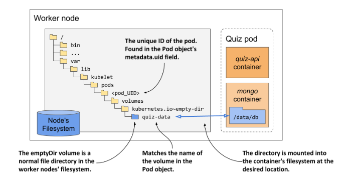

# Kubernetes in Action, 2nd Edition

## Chapter 7. Mounting storage volumes into the Pod's containers


### Fortune pod with or without a volume
- [fortune-no-volume.yaml](fortune-no-volume.yaml) - YAML manifest file for the `fortune-no-volume` pod
- [fortune-emptydir.yaml](fortune-emptydir.yaml) - YAML manifest file for the `fortune-emptydir` pod with an emptyDir volume
- [fortune.yaml](fortune.yaml) - YAML manifest file for the `fortune` pod with two containers that share a volume

### MongoDB pod with external volume
- [mongodb-pod-gcepd.yaml](mongodb-pod-gcepd.yaml) - YAML manifest file for the `mongodb` pod using a GCE Persistent Disk volume
- [mongodb-pod-aws.yaml](mongodb-pod-aws.yaml) - YAML manifest file for the `mongodb` pod using an AWS Elastic Block Store volume
- [mongodb-pod-nfs.yaml](mongodb-pod-nfs.yaml) - YAML manifest file for the `mongodb` pod using an NFS volume
- [mongodb-pod-hostpath.yaml](mongodb-pod-hostpath.yaml) - YAML manifest file for the `mongodb` pod using a hostPath volume (for use in _Minikube_)
- [mongodb-pod-hostpath-kind.yaml](mongodb-pod-hostpath-kind.yaml) - YAML manifest file for the `mongodb` pod using a hostPath volume (for use in _kind_)

### Using a hostPath volume
- [node-explorer.yaml](node-explorer.yaml) - YAML manifest file for the `node-explorer` pod
- [node-explorer-directory.yaml](node-explorer-directory.yaml) - YAML manifest file for the `node-explorer` pod with the hostPath volume type set to Directory


# K8s-in-action: Chap 07

## running the quiz service in a pod without a volume
```bash
$ k apply -f pod.quiz.novolume.yaml

$ k port-forward quiz 8080
```
## adding questions to the database
```bash 
$ k exec -it quiz -c mongo -- mongo

use kiada

db.questions.insert({
... id: 1,
... text: "what does k8s mean?",
... answers: ["Kates", "Kubernetes", "Kooba Dooba Doo!"],
... correctAnswerIndex: 1})

// to confirm questions that inserted are now stored in the database:

db.questions.find()

// to retrieve a random question through the Quiz API:

$ curl localhost:8080/questions/random
```
## Restarting the MongoDb database

MongoDb db >> container's filesystem, they are lost every time the container is restarted.
To confirm:
```bash
$ k exec -it quiz -c mongo -- mongo admin --eval "db.shutdownServer()"
```
The container is new, with a fresh filesystem, it doesn't contain the questions you entered. To confirm:
```bash
k exec -it quiz -c mongo -- mongo --quiet --eval "db.questions.count()"
> 0
```
what happened is the pod is still the same, the quiz-api container has been running fine this whole time. Only the mongo container was restarted (recreated)
### this is why you need volume to persist data in case of restarting container
## 7.1.2 Understanding how volumes fit into pods
Volumes are component within the pod and thus share its lifecycle.  

A volume is defined at the pod level and then mounted at the desired location in the container. 

The lifecycle of volume is tied to the lifecycle of the entire pod and is independent of the lifecycle of the container in which it is mounted. Due to this fact, volumes are also used to persist data across container restarts.
### Persisting files across container restarts
Volumes in a pod are created when the pod is set up - before containers are started. Volumes are torn down when the pod is shut down.  

Each time a container restarted, the volumes that the container is configured to use are mounted in the container's filesystem. App running in the container can read from the volume and write to it if the volume and mount are configured to be writable.  

### Mounting multiple volumes in a container
Why you want to mount multiple volumes in one container?  

Because these volumes may serve different purposes and can be of different types with different performance characteristics.  

In pods with more than one container , some volumes can be mounted in some containers but not in others . This is especially useful when a volume contains sensitive information that should only be accessible to some containers.
### Sharing file between multiple containers
A volume can be mounted in more than one container so that applications running in these containes can share files.  

For example, you create a pod with a web server and a content-producing agent both running in two different containers.  

Content-producing agent >> volume >> web-server >> user.  

The same volume can be mounted at different places in each container, depending on the needs of container itself.  

/var/data [read/write] mount to volume [read-only] mount to /var/html.  

Volume mounted in each container can be configured either as read/write or ad read-only.  

Best practise of security, prevent the web-server from writing to the volume or this will allow attacker to compromise the system if the web-server software has a vulnerability that allows attackers to write arbitraty files to the filesystem and execute them.  

Other examples of using a single volume in two containers are cases where a sidecar container runs a tool that processes or rotates the web server log or when an init container creates configurations files for the main app container.  
### Persisting data across pod instances

A volume die when the pod die, but depending on the volume type, the files in the volume can remain intact after the pod and volume die and can be later mounted into a new volume.  

The pod volume can map to persistent storage outside the pod, typically network-attached storage volume is thus persistent and can be used by the application event after the pod it runs in is replaced with a new pod running on a different worker node.  

### Sharing data between pods 
If you use a simple local directory on the worker node's filesystem, the pods in it can have map to that directory and share files.  

If the persistent storage is a network-attached storage volume, the pods may be able to use it even when they are deployed to different nodes. Depending on whether the underlying storage technology supports concurrently attaching the network volyme to multiple computers.  

Like NFS (Network File System) allow you to attach volume in read/write mode on multiple computers, other technologies available in cloud env, such as Google Compute Engine Persistent Disk...   
### Introducing the available volume types
When you add a volume to a pod, you must specify the volume type. A wide range of volume types is available. Here are some of the supported volume types:
- emptyDir : A simple directory that allows the pod to store data for the duration of its life cycle. The directory is created just before the pod starts and is initially empty - hence the name. 
- gitRepo : which is now deprecated, is initialized by cloning a Git repository. It's is recommended to use and emptyDir volume and init it using and init conatiner.
- hostPath : Used for mounting files from the worker node's filesystem into pod. 
- nfs : and NFS share mounted into the pod.
- gcePersistentDisk (Google Compute Engine Persistent Disk),
- awsElasticBlockStore (Amazon Web Services Elastic Block Store),
- azureFile, azureDisk
- cephfs, cinder, fc, flexVolume, flocker, glusterfs, iscsi, portworxVolume, quobyte, rbd, scaleIO, storageos, photonPersistentDisk, vsphereVolume : Used for mounting other types of network storage.
- configMap, secret, downwardAPI, projected : Special types of volumes used to expose information about the pod and other Kubernetes object through files. Used to configure the application running in the pod. Learn more in Chap 9
- persistentVolumeClaim : A portable way to integrate external storage into pods. Instead of pointing directly to an external storage volume, this volume type points to a PersistentVolumeClaim object that points to a PersistentVolume object that finally references the actual storage. Learn more in next chapter.
- csi : a pluggable way of adding storage via the Container Storage Interface. This volume type allows anyone to implement their own storage driver that is the referenced in the csi volume definition. DUsing pod setup, the CSI driver is called to attach the volume to the pod.   
These volume types serve different purposes. Learn more on next section.
## 7.2 Using an emptyDir volume
The simplest volume type is emptyDir. In a pod with two or more containers, an emptyDir volume is used to share data between them.
## 7.2.1 Persisting files across container restarts
### Adding an emptyDir volume to a pod
You edit the definition of the quiz pod so that the MongoDb process writes its files to the volume instead of the filesystem of the container it runs in.  

The steps is :  
- Add emptyDir volume to the pod
- Mount the volume to the container.  
### Configure the emptyDir volume
The emptyDir volume likes other volumes. It come with a few configuration options which is the sub-fields that allow you to configure the volume.  

Configuration options for an emptyDir volume:  
- medium: if left empty, default medium of the host node is used, other option is Memory, virtual memory filesystem where the files are kept in memory instead of on the hard disk.
- sizeLimit :the total amount of local storage required for the directory, whether on disk or in memory. (e.g : 10Mi)
### Mounting the volume to a container
### Table 7.2 Configure options for a volume mount

| Field | Description     |
| :-------- | :---------- |
| `name` | name of the volume to mount. Must match one of the volumes defined in the pod | 
| `mountPath` | the path within the container at which to mount the volume. |
| `readOnly` | Whether to mount the volume ad read-only. Defaults to false. |
| `mountPropagation` | Specfifies what should happen if additional filesystem volumes are mounted inside the volume. Defaults to None, which mearns that the container wont reveive any mounts that are mounted by the host, and the host wont receive any mounts that are mounted by the container. `HostTocontainer` means that the container will receive all mounts that are mounted into this volume by the host , but not the other way around. `Bidirectional` means that the container will receive mounts added by the host, and the host will receive mounts by the container |
| `subPath` | Default to "" which indicates that the entire volumes is to be mounted into the container. When set to a non-empty string , only the specified `subPath` within the volume is mounted into the container.|
| `subPathExpr` | just like `subPath` but can have environment variable references using the syntax $(ENV_VAR_NAME). Only environment variables that are explicitly defined in the container definition are applicable. Implicit variables such as HOSTNAME will not be resolved. You'll learn how to specify environment variables in chapter 9.|

In most case, you only need `name`, `mountPath`, whether the mount should be `readOnly`.  
`mountPropagation` option comes to play for advance use-cases where additional mounts are added to the volume's file tree later, either from the host or from the container. The `subPath` and `subPathExpr` options when mounting single volume with multi directories mount to different containers instead of using multiple volumes.  

The `subPathExpr` is used when a volume is shared by multiple pod replicas.
### Understanding the lifespan of an emptyDir volume
- Run pod.quiz.emptydir.yaml
- Insert question using the shell script `insert-question.sh`
- Check if the question was inserted to the mongo:
```bash
$ k exec -it quiz -c mongo -- mongo kiada --quiet --eval "db.questions.count()"
```
- Now, shutdown the server using:
```bash
$ k exec -it quiz -c mongo -- mongo admin --eval "db.shutdownserver()"
```
- Check the mongo container was restarted
- After restarting, check that the question still remain in the database:
```bash
$ k exec -it quiz -c mongo -- mongo kiada --quiet --eval "db.questions.count()"
```
The result should be "1" so that the data has survived the container restart.  
The question is where exactly the files are stored in volume?
### Understanding where the file in an emptyDir are stored
The files in an `emptyDir` volume are stored in a directory of the host node's filesystem.   
This directory is mounted into the container at the desired location.  



the `pod_UID` is the unique ID of the pod, To see the directory, run this command to get `pod_UID`:
```bash
k get pod quiz -o json | jq .metadate.uid
>> "4f49f452-2a9a-4f70-8df3-31a227d020a1"
```

